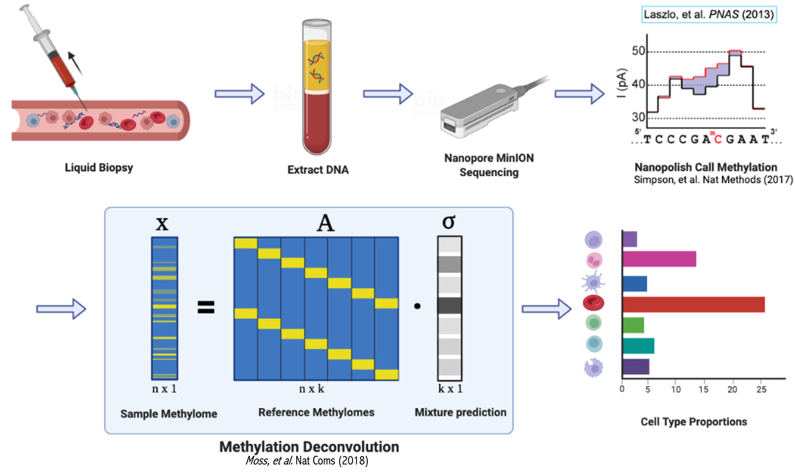

# Simpson Lab cfDNA Analysis Pipeline

This pipeline follows a suite of functions to compute fragmentation and methylation patters of cfDNA samples

## External Dependencies
1. [Guppy](https://nanoporetech.com/nanopore-sequencing-data-analysis)
2. [Nanopolish](https://github.com/jts/nanopolish)
3. [mbtools](https://github.com/jts/mbtools)
4. [Reriomodels](https://github.com/nanoporetech/rerio)

## Setup
1. Install the environment with [Conda](https://docs.conda.io/en/latest/miniconda.html)
```
conda env create --file environment.yaml
```
2. Download the above dependencies with `git clone`
	- when downloading Nanopolish, install the `methylation_bam` version
	```
	git clone --recursive https://github.com/jts/nanopolish.git
	cd nanopolish
	git checkout methylation_bam
	make
	```
3. Edit `nextflow.config` to point the relevant parameters to where you installed them. A reference sequence is also required here. HDF5 plugin is installed with nanopolish. These are the following lines that need to be edited:
```
...
env.HDF5_PLUGIN_PATH=".../etc/"
...
guppy = ".../guppy-5.0.11/bin/guppy_basecaller"
reference = "/.mounts/labs/simpsonlab/data/references/GRCh38_no_alt_analysis_set.GCA_000001405.15.fna"
nanopolish = ".../nanopolish/nanopolish"
mbtools = ".../mbtools/target/release/mbtools"
reriomodels = ".../rerio/basecall_models"
...
```

## Run
Make a new directory for your run. Inside that directory make another directory called data:
```
mkdir dev1
cd dev1
mkdir data
```
Then inside the data directory make symbolic links to the directories where the nanopore runs are kept.
```
cd data
ln -s <PATH_TO_DATA>
```
Then whilst in the run directory execute the nextflow script with the following command which takes as input the path to this repository.
```
cd ..
nextflow run <.../nanopore_cfdna/>
```
If you have multiple cores available use the `--threads` parameter to specify how many you would like to use.

## Results
The nextflow pipeline automatically creates a `work` directory and results directories. Inside you will find:
- `sample.fragmentation_ratios.tsv`: Ratio of short to long reads in 5Mb bins. 
- `sample.bamstats.tsv`: *Pomoxis* alignment statistics
- `sample.read_modifications.tsv`: nanopolish methylation calling for reads
- `sample.referenceAtlas.region_modifications.tsv`: nanopolish methylation calling for each region in the deconvolution reference atlas
- `sample.bam`: alignment against reference
- `deconv_output.referenceAtlas.method.tsv`: Methylation deconvolution output. Estimation of proportion of cell type heterogeneity for each sample.
- `deconv_output.referenceAtlas.method.png`: Stacked bar plot of cell type heterogeneity.
- `sample.fragmentome.pdf`: Ratio of short (100-150) to long (151-220) read fragments in 5Mb bins across the genome (normalized). More info [here](https://www.nature.com/articles/s41467-021-24994-w). 

